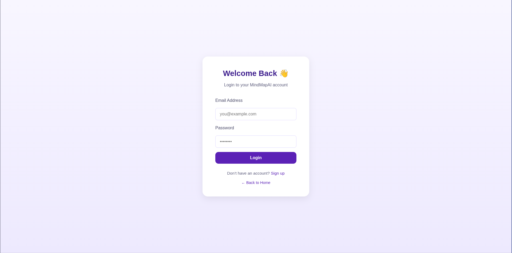
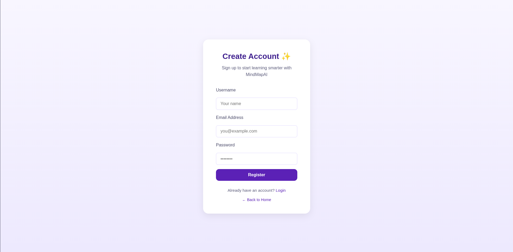
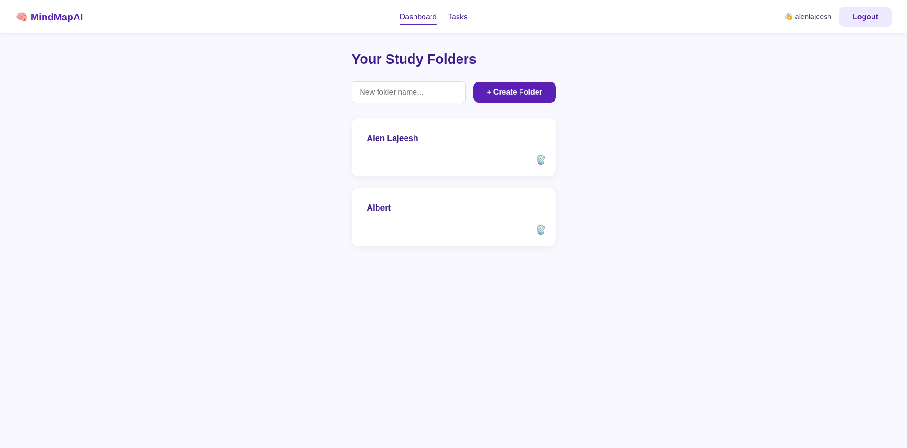
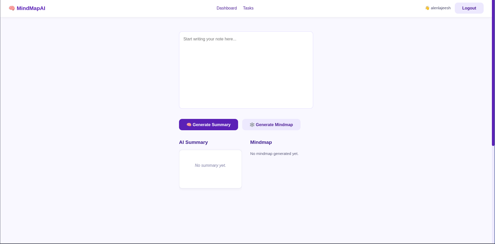
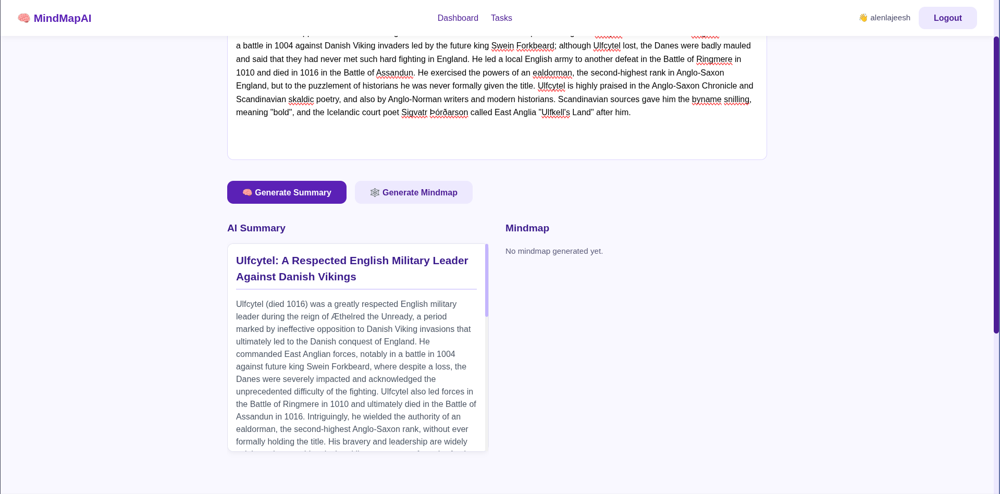
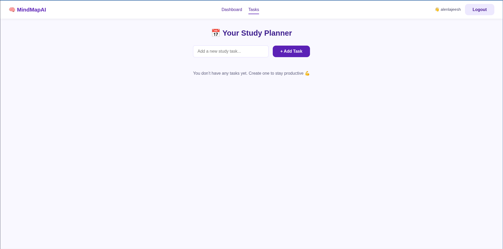

# 🧠 MindMapAI – AI-Powered Visual Knowledge Mapper

**MindMapAI** is an intelligent MERN-based study and productivity platform that helps learners, researchers, and professionals organize and understand complex information visually.  
It combines **AI-driven summarization**, **interactive mind mapping**, and a **task scheduler** into one seamless workspace.

---

## 🚀 Overview

MindMapAI transforms your notes into **AI-generated summaries** and **concept maps**, enabling structured learning and better retention.  
Each note can be **summarized by AI**, **visualized as a mind map**, and **linked to related concepts**, while the **task manager** helps you plan study sessions effectively.

> “Turn your notes into knowledge — powered by AI.”

---

## ✨ Key Features

### 🗂 Folder & Note Management
- Organize notes under folders for each subject or topic.
- Create, edit, and delete folders or notes.
- Rich-text note editing with autosave and Markdown support.

### 🤖 AI Summarization
- Instantly summarize any note using **Google Gemini AI**.
- Generates:
  - A concise **summary heading**  
  - **Detailed explanation**
  - **Important points**
  - Timestamp of last AI generation

### 🧩 Mind Map Generation
- Convert summarized notes into **interactive concept maps**.
- Each node represents a concept, connected by relationships.
- Click nodes to expand, view details, or generate new related ideas.

### ⏰ Task Scheduler
- Create and manage study or project tasks.
- Set titles, descriptions, and time limits.
- Edit or delete tasks from your dashboard.

### 📤 Export & Share
- Export mind maps as **PNG images** or **JSON structures**.
- Share with collaborators or save for offline use.

---

## 🖼️ User Interface (Frontend Screens)

Below are example UI sections — replace the placeholders with your actual image file paths once added to the repo.

### 🔐 Login / Register
User authentication with JWT.  
Provides access to personalized notes, folders, and AI data.




---

### 🏠 Dashboard
Displays all folders and tasks at a glance.  
Allows quick access to folders and the task scheduler.



---

### 📁 Folder View
Each folder lists its associated notes with quick-create and edit options.


---

### 📝 Note Editor
The core workspace for writing and editing notes.  
Integrates AI tools and mind map generation.



#### Features inside Note Editor:
- AI summary generation
- File uploads
- Mind map viewer (React Flow or D3.js)
- Save and modify notes instantly

---

### 🧠 AI-Generated Mind Map
Visual representation of note concepts and relationships.  
Interactive and expandable using React Flow.




---

### 📅 Task Manager
Manage all upcoming and completed tasks for study sessions.



---

## ⚙️ How It Works

### **1. Frontend (React.js)**
- Built with **React + Axios + React Router**.
- Components: Dashboard, FolderList, NoteEditor, MindMap, and TaskManager.
- Communicates securely with backend APIs using JWT authentication.

### **2. Backend (Node.js + Express.js)**
- Handles authentication, folders, notes, summaries, nodes, and tasks.
- Integrates **Google Gemini AI** for note summarization and node generation.
- All routes are protected with JWT middleware.

| Route | Method | Description |
|-------|---------|-------------|
| `/api/auth/register` | POST | Register a new user |
| `/api/auth/login` | POST | Login user and return token |
| `/api/folders` | GET/POST/PUT/DELETE | Manage user folders |
| `/api/notes` | GET/POST/PUT/DELETE | CRUD operations for notes |
| `/api/notes/:noteId/ai-summary` | POST | Generate AI summary for a note |
| `/api/nodes/:noteId/generate` | POST | Generate concept nodes using AI |
| `/api/tasks` | GET/POST/PUT/DELETE | Manage scheduled tasks |

---
## 🧠 AI Layer – Google Gemini API

MindMapAI integrates **Google Gemini AI** to intelligently process and understand your note content.  
It performs **summarization**, **concept extraction**, and **relationship mapping**, turning your written notes into interactive visual mind maps.

# 🚀 AI-Powered Features

### 🤖 AI Summarization
Condenses long notes into short, readable summaries.

### 🧩 Node Generation
Extracts key ideas and relationships for mind map visualization.

### 🌐 Context Expansion *(Future Feature)*
Fetches related data using Retrieval-Augmented Generation (RAG).

### 🧠 Smart Learning Tools
Upcoming quiz and flashcard generation for better retention.

---

## 🧰 Tech Stack

| **Layer**              | **Technology**                             |
|------------------------|---------------------------------------------|
| **Frontend**           | React.js, React Router, Axios, CSS          |
| **Backend**            | Node.js, Express.js                         |
| **Database**           | MongoDB                                    |
| **AI Integration**     | Google Gemini API                          |
| **Visualization**      | React Flow / D3.js                         |
| **Authentication**     | JWT (JSON Web Tokens)                      |
| **Version Control**    | Git + GitHub                               |
| **Deployment (Optional)** | Vercel (Frontend), Render / Railway (Backend) |

---

## 🪄 Benefits

- 🧭 Converts unstructured notes into structured visual knowledge  
- 💡 Enhances understanding with interactive AI mind maps  
- 🔁 Encourages revision via summaries and future quiz integration  
- 🧠 Combines AI + visualization + productivity in one workspace  
- ⏱️ Saves time and simplifies complex learning tasks  

---

## 🧭 Getting Started

### 1️⃣ Clone the Repository
```bash
git clone https://github.com/<your-username>/MindMapAI.git
cd MindMapAI
```

### Install Dependencies
```
cd backend && npm install
cd ../frontend && npm install
```

### Run the App
# Start backend
```
npm run start
```

# Start frontend
```
npm run start
```

Now open http://localhost:3000 in your browser 🚀

---

## 🧠 App Flow

1. User logs in or registers  
2. Creates **folders** to organize subjects or topics  
3. Adds **notes** under folders  
4. Generates **AI summaries** and **mind maps** using Gemini API  
5. Manages daily goals using the **task manager**  
6. Optionally exports notes or maps for sharing  

---

## 🧩 Future Enhancements
- 🌐 Wikipedia / document-based RAG (Retrieval-Augmented Generation)  
- 🧍 Real-time collaborative editing for shared mind maps  
- 📱 Mobile-friendly layout with offline note access  
- 🧾 Quiz and flashcard generation for active learning  

---

## 🧾 License
This project is **Open Source** and currently unlicensed.  
You may freely use, modify, and contribute to  wit.

---

## 💡 Acknowledgments
- **Google Gemini AI** for intelligent summarization  
- **React Flow / D3.js** for mind map visualization  
- **MongoDB Atlas** for reliable data storage  
- **CSS / Tailwind** for modern responsive UI  

---

> 🧠 *"MindMapAI — Transforming your notes into networks of knowledge."*


